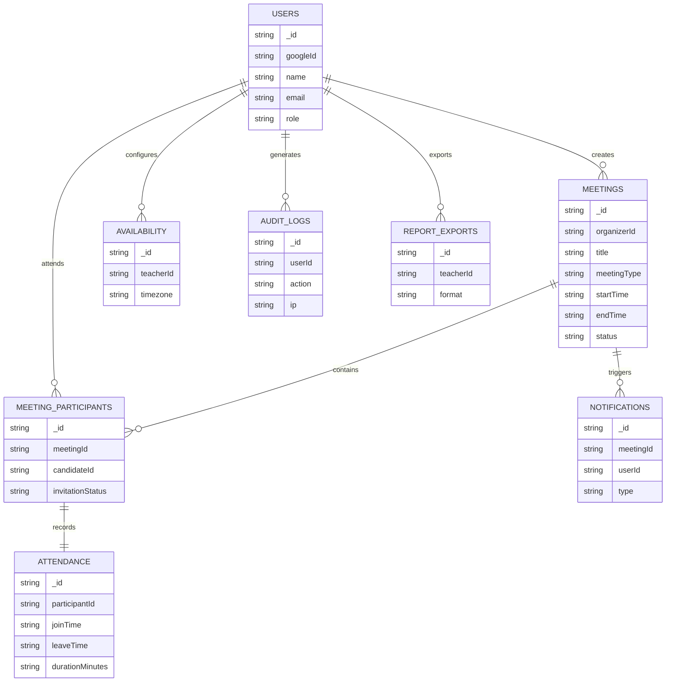

# Teacher Meeting Scheduler & Attendance Management System

A full-stack MERN application for scheduling Google Meet meetings, automating calendar management, tracking attendance, and generating reports.

---

## Features

- **Google OAuth 2.0** — Secure sign-in with automatic account creation
- **Meeting Management** — Create, edit, cancel one-time or recurring meetings
- **Google Calendar & Meet Integration** — Auto-generate Meet links and sync to calendars
- **Automated Email Notifications** — Invitations + reminders (24h, 1h, 15m before)
- **Attendance Tracking** — Mark join/leave times with status (present/late/left early/absent)
- **Analytics Dashboard** — Attendance rates, meeting types, trends via charts
- **Export Reports** — Download attendance as PDF or Excel (.xlsx)
- **Role-Based Access** — Teacher (organizer) and Candidate (participant) roles
- **Availability Management** — Working hours, holidays, blocked time slots
- **Audit Logging** — Track all key actions

---

## Technology Stack

| Layer | Technology |
|-------|-----------|
| Frontend | React 18, TypeScript, Redux Toolkit, Tailwind CSS |
| Backend | Node.js, Express, TypeScript |
| Database | MongoDB with Mongoose |
| Auth | Google OAuth 2.0 + JWT |
| Calendar | Google Calendar API |
| Email | Nodemailer (Gmail) |
| Queue | Bull + Redis |
| Docs | Swagger/OpenAPI |
| Deploy | Docker + Docker Compose |

---

## Prerequisites

- Node.js >= 18.x
- MongoDB (local or Atlas)
- Redis (local or cloud)
- Google Cloud Console project with:
  - OAuth 2.0 credentials
  - Google Calendar API enabled
  - Gmail API enabled (optional)
- Gmail account with App Password (for email notifications)

---

## Quick Start (Local Development)

### 1. Clone the repository

```bash
git clone https://github.com/yourusername/teacher-meeting-scheduler.git
cd teacher-meeting-scheduler
```

### 2. Set up environment variables

```bash
# Root (for Docker)
cp .env.example .env

# Backend
cp backend/.env.example backend/.env

# Frontend
cp frontend/.env.example frontend/.env
```

Fill in your values in each `.env` file.

### 3. Google OAuth Setup

1. Go to [Google Cloud Console](https://console.cloud.google.com/)
2. Create a new project
3. Enable **Google Calendar API** and **Google+ API**
4. Go to **Credentials** → **Create Credentials** → **OAuth 2.0 Client ID**
5. Set Application type to **Web application**
6. Add authorized redirect URI: `http://localhost:5000/api/auth/google/callback`
7. Copy Client ID and Client Secret to your `.env` files

### 4. Install dependencies

```bash
# Backend
cd backend && npm install

# Frontend
cd ../frontend && npm install
```

### 5. Run the application

```bash
# Terminal 1 — Backend
cd backend && npm run dev

# Terminal 2 — Frontend
cd frontend && yarn start
```

Open [http://localhost:3000](http://localhost:3000)

---

## Docker Deployment

```bash
# 1. Copy and fill environment variables
cp .env.example .env
# Edit .env with your credentials

# 2. Build and start all services
docker-compose up --build -d

# 3. View logs
docker-compose logs -f

# 4. Stop services
docker-compose down
```

Services started:
- **Frontend**: http://localhost:3000
- **Backend API**: http://localhost:5000
- **Swagger Docs**: http://localhost:5000/api/docs
- **MongoDB**: port 27017
- **Redis**: port 6379

---

## API Documentation

Interactive Swagger UI: **http://localhost:5000/api/docs**

### Key Endpoints

| Method | Endpoint | Description |
|--------|---------|-------------|
| GET | /api/auth/google | Initiate Google OAuth |
| GET | /api/auth/me | Get current user |
| POST | /api/auth/logout | Logout |
| GET | /api/meetings | List meetings |
| POST | /api/meetings | Create meeting |
| GET | /api/meetings/:id | Get meeting detail |
| PUT | /api/meetings/:id | Update/reschedule meeting |
| PATCH | /api/meetings/:id/cancel | Cancel meeting |
| GET | /api/meetings/dashboard | Dashboard stats |
| GET | /api/attendance/meeting/:id | Get meeting attendance |
| POST | /api/attendance/meeting/:id/mark | Mark single attendance |
| POST | /api/attendance/meeting/:id/bulk | Bulk mark attendance |
| POST | /api/attendance/meeting/:id/join | Candidate joins meeting |
| GET | /api/reports/analytics | Get analytics |
| GET | /api/reports/export/excel | Export Excel report |
| GET | /api/reports/export/pdf | Export PDF report |
| GET | /api/availability | Get teacher availability |
| PUT | /api/availability | Update availability |

---

## Folder Structure

```
teacher-meeting-scheduler/
├── backend/
│   ├── src/
│   │   ├── config/          # DB, Passport, Swagger config
│   │   ├── controllers/     # Route handlers
│   │   ├── jobs/            # Bull queue jobs (reminders)
│   │   ├── middleware/      # Auth, error handler
│   │   ├── models/          # Mongoose schemas
│   │   ├── routes/          # Express routers
│   │   ├── services/        # Google Calendar, Email
│   │   ├── utils/           # Logger
│   │   └── index.ts         # Entry point
│   ├── Dockerfile
│   ├── package.json
│   └── tsconfig.json
│
├── frontend/
│   ├── src/
│   │   ├── components/      # Reusable UI components
│   │   │   ├── common/
│   │   │   └── layout/
│   │   ├── hooks/           # Custom React hooks
│   │   ├── pages/           # Page-level components
│   │   ├── services/        # Axios API calls
│   │   ├── store/           # Redux slices + store
│   │   ├── types/           # TypeScript interfaces
│   │   ├── App.tsx
│   │   └── index.tsx
│   ├── Dockerfile
│   ├── nginx.conf
│   ├── package.json
│   └── tailwind.config.js
│
├── docker-compose.yml
├── .env.example
├── .gitignore
└── README.md
```

---

## Data Models

### User
- googleId, name, email, profileImage, role (teacher/candidate), refreshToken, lastLogin

### Meeting
- title, description, meetingType, organizer, candidates[], startTime, endTime, googleMeetLink, googleEventId, status, recurrence, notes

### Attendance
- meeting, candidate, joinTime, leaveTime, duration, status (present/late/left_early/absent)

### Notification
- meeting, recipient, type (invitation/reminder_24h/1h/15m/cancellation), status, scheduledAt

### Availability
- teacher, workingHours, workingDays, holidays, blockedSlots

### AuditLog
- user, action, resource, resourceId, details, ip, userAgent

---

## Environment Variables Reference

| Variable | Description | Example |
|----------|-------------|---------|
| `PORT` | Backend server port | `5000` |
| `MONGODB_URI` | MongoDB connection string | `mongodb://localhost:27017/tms` |
| `JWT_SECRET` | JWT signing secret | `your-strong-secret` |
| `GOOGLE_CLIENT_ID` | Google OAuth client ID | From Cloud Console |
| `GOOGLE_CLIENT_SECRET` | Google OAuth secret | From Cloud Console |
| `GOOGLE_CALLBACK_URL` | OAuth redirect URI | `http://localhost:5000/api/auth/google/callback` |
| `FRONTEND_URL` | Frontend base URL | `http://localhost:3000` |
| `REDIS_URL` | Redis connection URL | `redis://localhost:6379` |
| `EMAIL_USER` | Gmail address | `you@gmail.com` |
| `EMAIL_PASS` | Gmail App Password | 16-char app password |

---
## Database Design (ER Diagram)





## License

MIT
#
